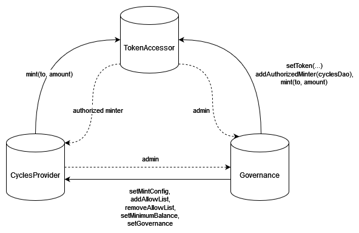

# CyclesDAO architecture

The CyclesDAO is composed of 3 canisters:

- The TokenAccessor provides access to the token to mint, so the CyclesProvider and the Governance canisters can mint.
- The CyclesProvider is responsible of exchanging the cycles against tokens, and feeding cycles to the configured canisters to power up.
- The Governance acts as an admin of the system. Via submissions and votes on proposals, it can configure the CyclesProvider canister or perform any other canister call.

## CyclesProvider canister interface (non-exhaustive)

### **configure**: ( *CyclesProviderCommand* ) -> ( variant { ok; err: *ConfigureError* } )
Update the configuration of the cycles DAO. Only the admin is allowed to call this function.
- ***SetCycleExchangeConfig***: Set the cycles exchange configuration.
- ***AddAllowList***: Add the canister to the list of canisters that receive cycles from *distributeCycles*.
- ***RemoveAllowList***: Remove a canister from the list of canisters that receive cycles from *distributeCycles*.
- ***SetAdmin***: Set the admin of the cycles DAO.
- ***SetMinimumBalance***: Set the minimum balance of cycles that the cycles DAO will keep for itself.

### **walletReceive**: () -> ( variant { ok: *MintRecord*; err: *WalletReceiveError* } )
Accept the cycles given by the caller and transfer freshly minted tokens in exchange, returning a mint record on success. This function is intended to be called from a cycle wallet that can pass cycles. The amount of tokens exchanged depends on the set cycles exchange configuration. If the CyclesProvider current cycles balance exceeds the greatest exchange level from its configuration, the method will refund all the given cycles. Note that it's possible that the walletReceive method succeeded but the actual mint failed, in that case the user can try to reclaim its token using the TokenAccessor *claimMintTokens* method.

### **distributeCycles**: () -> ()
Distribute the cycles to the every canister in the allowed list. Does nothing if all canisters already have a cycles amount greater than their minimum thresholds. This method is expected to be call regularly in a loop (e.g. javascript timer, or motoko heartbeat). If one of the canister ever traps, the method will resume with the next canister in the list. The last execution state of each canister can be found via printing the *getAllowList*.

### **requestCycles**: () -> ( variant { ok: *MintRecord*; err: *CyclesTransferError* } )
Request to send cycles up to the cycles *balance_target*. This function is intended to be called from a canister that has been added via the method *configure(#AddAllowList)*, with *pull_authorized* set to true. Does nothing if the canister has a already a cycles amount greater than the minimum threshold.

### **getCycleExchangeConfig**: () -> ( vec *ExchangeLevel* )
Return the current cycles exchange configuration.

### **cyclesBalance**: () -> ( *nat* )
Get the current cycles balance of the CyclesProvider canister.

### **computeTokensInExchange**: ( *nat* ) -> ( *nat* )
Compute the amount of tokens that walletReceive will return in exhange of the given cycles at the time this function is called.

## TokenAccessor canister interface

@todo

## Governance canister interface

@todo